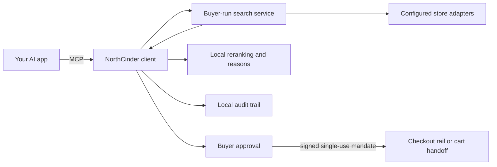

# NorthCinder

**Compare the evidence, explain the tradeoff, and ask before buying.**

NorthCinder adds strict product and seller facts, deterministic buyer-criteria ranking, and an inspectable decision record to your AI app. Its default brief shows at most three candidates: top fit, lower risk, and a budget or different option when each exists.

Search is separate from purchase authority. Checkout requires signed approval for the exact offer and quantity. Outcomes stay local, reminders only notify, and seller payment never improves rank.

NorthCinder is software you run with your AI app. The repository owner does not operate a NorthCinder service. There is no account, hosted control plane, or telemetry service.

## Get started

You need Node.js 20 or later and an MCP-capable AI app.

```sh
npx northcinder init
```

It prints the MCP configuration. Local mode is buyer-run, keyless, and one process, with no fixed port or second service command. Try:

> Find black wool running shoes under $130. Compare price, delivery, fit, and merchant trust. Tell me why the winner ranked first and which options were ruled out.

## Research a product or seller

NorthCinder has product and seller research contracts. Before research, your MCP host must:

1. Read `northcinder://research/product` or `northcinder://research/seller`.
2. Call `create_research_plan` with the concrete request and exact subject.
3. Follow its checklist and limits with tools you control.

All builds include both skills. Exact identity, landed cost, policies, and sourced claims establish readiness; missing evidence stays provisional. Research affects readiness and provenance, not rank. Routine-use support is qualified only for Codex CLI 0.147.0 with `gpt-5.6-luna` at medium reasoning over local STDIO MCP. Other host/model combinations remain unqualified.

## Inspecting a decision

The default brief shows at most three role-based candidates. It does not claim a universal best. Other finalists, rejections, reasons, and provenance remain available.

The buyer-local dashboard shows bounded, redacted decision state and exact-attribution outcomes. It excludes session buyer context, full claims, and raw rejected-offer detail.

## After an order

`record_order_outcome` records buyer-confirmed outcomes only. A decision is
updated only for one exact checkout tuple. Warranty and maintenance dates are
explicit buyer-local facts: reminders notify only, never act. Feedback proposals
become preferences only when confirmed or repeated independently.

## The contract you can inspect

| Concern | NorthCinder's rule | Evidence |
| --- | --- | --- |
| Ranking | Buyer criteria determine order. Seller payment is not an input. | [Ranking specification](./docs/RANKING.md) and [ranking source](./packages/protocol/src/ranking/rank.ts) |
| Sponsored offers | Labeled sponsored offers stay below every organic result. | [Neutrality audit](./docs/NEUTRALITY-AUDIT.md) |
| Coverage | Unavailable and unconfigured stores stay visible. | [Adapter contract](./packages/protocol/src/adapter/store-adapter.ts) |
| Merchant trust | Every merchant has explicit evidence or an honest unknown state. | [Trust specification](./docs/TRUST.md) |
| Checkout | A versioned signed mandate binds one exact offer, quantity one, and the spending cap. Old underbound mandates fail closed. | [Checkout package](./packages/checkout) |
| Audit | Recommendations, approvals, and checkout attempts go to a local audit trail. | [Client source](./client/src) |

The client reruns ranking over disclosed inputs. This verifies order, not catalog completeness or store facts.

## How NorthCinder works



The repository owner is not in this runtime path. You run the client and engine, choose stores, and keep local configuration and audit data.

## Self-hosted engine

A self-hosted engine requires `NORTHCINDER_API_KEYS` on the service, plus a matching `NORTHCINDER_CLIENT_KEY` bearer and `NORTHCINDER_SERVICE_URL` on the client. Bearer-authenticated engine URLs must use HTTPS, except for explicit loopback HTTP. The buyer generates the keys; NorthCinder does not.

## Store coverage

Store access varies. NorthCinder reports unavailable or blocked stores, not complete coverage.

| Store | What works today |
| --- | --- |
| [Shopify](./adapters/shopify/README.md) | Global and configured storefront catalog search use Shopify UCP with a buyer-controlled HTTPS agent profile. |
| [WooCommerce](./adapters/woocommerce/README.md) | Works with stores exposing its public Store API. |
| [eBay](./adapters/ebay/README.md) | Native search needs approved Buy API access. |
| [Etsy](./adapters/etsy/README.md) | Native search needs approved app access. |
| [Amazon](./adapters/amazon/README.md) | Read-only comparison uses a browser profile you control. It does not check out. |

Unconfigured native stores return `not_configured`. Your agent may continue on permitted product pages with browser tools it controls. NorthCinder accepts normalized product facts, not session data or page instructions. Agent-observed offers need native or merchant-protocol confirmation before checkout or an unattended watch.

## Privacy and purchase control

- AI-provider and store credentials stay in their existing buyer-controlled systems.
- NorthCinder does not send your searches, settings, or local history to the repository owner.
- Raw card details are rejected. Automated rails use opaque delegated payment tokens when available.
- Search and watches are not purchase permission. Every checkout needs its own approval.
- The approval mandate is single use and protected by a cross-process nonce ledger.

Read [privacy and software ownership](./docs/INDEPENDENCE.md) and the [security policy](./SECURITY.md) for the full boundary.

## Project status

`northcinder` 0.2.0 is the current npm release. Local mode does not need a NorthCinder account or hosted service. Store API credentials are optional; an unconfigured native connection stays visible, and your MCP host can continue with browser or search tools it already controls.

## Build from source

This is a pnpm workspace. Product packages need Node.js 20 or later; the private site workspace needs Node.js 22.12 or later.

```sh
corepack pnpm install --frozen-lockfile
corepack pnpm build
node northcinder/bin/northcinder.js init
```

Full release-verification commands are in [CONTRIBUTING.md](./CONTRIBUTING.md).

## Contributing and support

- Read [CONTRIBUTING.md](./CONTRIBUTING.md) before proposing a change.
- Use [GitHub Issues](https://github.com/cinderline/northcinder/issues) for reproducible bugs and focused work.
- Use [GitHub Discussions](https://github.com/cinderline/northcinder/discussions) for questions and open-ended ideas.
- Report vulnerabilities through [GitHub private vulnerability reporting](https://github.com/cinderline/northcinder/security/advisories/new), not a public issue.

NorthCinder is open source under the [MIT License](./LICENSE).
